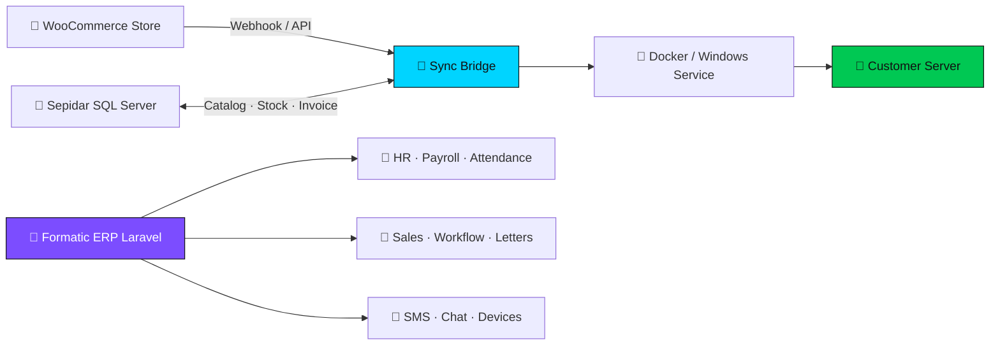

<!-- =========================================================
  ⚡ Mahdi Khakshour (@s3660h) — Ultra Profile README
  ========================================================= -->

<a href="https://github.com/s3660h">
  
</a>

<br/>

<div align="center">

# 🌌 مهدی خاکشور · Mahdi Khakshour

### 🚀 Full-Stack Engineer · ERP Architect · Integration Specialist


<br/>

<p>
  <a href="https://github.com/s3660h"></a>
  <a href="https://github.com/s3660h"></a>
  <a href="https://github.com/s3660h"></a>
  <a href="https://github.com/s3660h"></a>
  <a href="https://github.com/s3660h"></a>
</p>


&nbsp;


</div>

---

## 💥 Superpowers

<div align="center">

| 🏆 Superpower | ⚡ What it means in practice |
|:---|:---|
| 🏢 **ERP Builder** | HR · Payroll · Attendance · Sales · Workflow · Letters · Tasks · SMS · Telephony |
| 🔗 **Integration Ninja** | Sepidar SQL Server ↔ WooCommerce catalog, stock, orders & invoices |
| 🐳 **Deploy Beast** | Docker · GHCR · Watchtower · Windows Server installers · scheduled auto-updates |
| 🛡️ **Production Mindset** | Systems that run on **customer servers**, not just localhost demos |
| 🧩 **Full-Stack PHP** | Laravel 12 · Blade · Vite · REST APIs · MySQL · SQL Server |

</div>

---

## 🧠 About Me

```text
╔══════════════════════════════════════════════════════════════╗
║  👨‍💻  Name      : Mahdi Khakshour (@s3660h)                   ║
║  🎯  Role      : Full-Stack / ERP / Integration Engineer     ║
║  🌍  Location  : Iran 🇮🇷                                     ║
║  💼  Status    : Open to serious projects & collaborations   ║
║  ☕  Fuel      : Clean architecture + real customer feedback ║
╚══════════════════════════════════════════════════════════════╝
```

من سیستم‌هایی می‌سازم که **کسب‌وکار روی آن‌ها می‌چرخد**:

- 🔥 ERP سازمانی با ماژول‌های واقعی روزمره
- 🔁 پل‌های پایدار بین حسابداری، فروشگاه آنلاین و ابزارهای داخلی
- 📦 بسته‌بندی، نصب، آپدیت و نگهداری روی سرور مشتری
- 🎯 کیفیت بالاتر از نمایش عمومی — خیلی از کارها private می‌مانند

> 💬 **شعار من:** کد تمیز · دیپلوی مطمئن · مشتری آسوده

---

## 🛠️ Arsenal · Tech Stack

<div align="center">

### 💎 Core Stack
<a href="https://skillicons.dev">
  
</a>

<br/><br/>

| Layer | Technologies |
|:---|:---|
| ⚙️ **Backend** | `PHP 8.2+` · `Laravel 12` · `REST API` · `Queues` · `Auth` · `Eloquent` |
| 🗄️ **Databases** | `MySQL` · `Microsoft SQL Server` · migrations · reporting queries |
| 🎨 **Frontend** | `Blade` · `JavaScript` · `Bootstrap` · `Vite` · `Chart.js` · `ECharts` |
| 🐳 **DevOps** | `Docker` · `GHCR` · `GitHub Actions` · `Watchtower` · `CI/CD` |
| 🛒 **Commerce** | `WooCommerce REST` · webhooks · catalog & order sync |
| 🧾 **ERP / Org** | Sepidar bridges · ZKTeco attendance · SMS · telephony hooks |
| 🪟 **Ops Reality** | Windows Server · scheduled tasks · silent auto-update · installer scripts |

</div>

---

## 🏗️ Architecture Snapshot

<div align="center">



</div>

---

## 💼 Flagship Work

<div align="center">

### 🏢 Formatic ERP
**Laravel 12 enterprise platform**

| 📦 Module | ✨ Capability |
|:---|:---|
| 👥 Personnel & HR | staff profiles, roles, organizational ops |
| ⏱️ Attendance | ZKTeco devices, shifts, corrections, holidays |
| 💰 Payroll | salary flows & financial requests |
| 📈 Sales | sales workflows & reporting |
| 🔁 Workflow | approvals, requests, process routing |
| ✉️ Letters | templates & formal correspondence |
| ✅ Tasks | operational task tracking |
| 💬 Comms | chat, SMS, notifications, telephony |

<br/>

### 🔗 Sepidar ↔ WooCommerce Sync
**Production bridge for real stores**

| ⚡ Flow | 🚀 Result |
|:---|:---|
| 📦 Catalog sync | prices & stock from Sepidar → Woo |
| 🧾 Order bridge | store orders → Sepidar pre-invoice / invoice |
| 🪟 Windows mode | no-Docker installers + scheduled `git pull` |
| 🐳 Docker mode | GHCR image + Watchtower auto-update |
| 🔐 Secure ops | tokens, env configs, customer-ready deploy kits |

</div>

🔒 *Client systems stay private by design — reliability > vanity repos.*

---

## 📈 Impact Style Metrics

<div align="center">

| 🎯 Focus | 💪 How I deliver |
|:---|:---|
| ⏱️ Time-to-update | auto-update pipelines for client machines |
| 🛡️ Stability | ff-only pulls, health-minded deploy scripts |
| 🧩 Integration depth | SQL Server + Woo REST + webhooks |
| 📦 Ship readiness | docs, `.env.example`, installers, runbooks |
| 🧠 Maintainability | clear modules, boring reliable code |

</div>

---

## 📊 GitHub Analytics

<div align="center">
  
  
</div>

<br/>

<div align="center">
  
</div>

<br/>

<div align="center">
  
</div>

<br/>

<div align="center">
  
</div>

---

## 🐍 Contribution Snake

<div align="center">
  <picture>
    <source media="(prefers-color-scheme: dark)" srcset="https://raw.githubusercontent.com/s3660h/s3660h/output/github-contribution-grid-snake-dark.svg"/>
    <source media="(prefers-color-scheme: light)" srcset="https://raw.githubusercontent.com/s3660h/s3660h/output/github-contribution-grid-snake.svg"/>
    
  </picture>
</div>

---

## 🧭 Current Mission Board

```diff
+ ⚡ Hardening auto-update & deploy reliability on client servers
+ 🏢 Expanding Formatic ERP modules (payroll / attendance / sales / workflow)
+ 🔌 Cleaner Sepidar ↔ WooCommerce sync edge-cases
+ 🐳 Stronger Docker + GHCR + Actions pipelines for PHP products
+ 📚 Better operator docs for Windows & Docker installs
```

---

## 🧬 How I Work

<div align="center">

| 🧠 Principle | 📌 Meaning |
|:---|:---|
| 🎯 **Ship real** | If it can't run on the client's machine, it's not done |
| 🧼 **Keep it boring** | Predictable code > clever tricks |
| 🔁 **Automate updates** | Humans shouldn't babysit routine deploys |
| 🔐 **Respect privacy** | Customer systems stay private |
| 📝 **Document ops** | Install / update / recovery must be clear |

</div>

---

## 🤝 Let's Build Something Serious

<div align="center">

### 💬 آماده همکاری روی پروژه‌های ERP، یکپارچه‌سازی و دیپلوی سازمانی

<a href="https://github.com/s3660h">
  
</a>
<a href="https://github.com/s3660h/s3660h/issues/new">
  
</a>
<a href="https://github.com/s3660h?tab=repositories">
  
</a>

<br/><br/>

⭐️ **اگر این پروفایل برات جالب بود، Follow کن و ستاره بده!** ⭐️

<br/>


</div>

---

<div align="center">

### 🔥 «کد خوب · سیستم پایدار · مشتری راضی»


**Mahdi Khakshour** · `@s3660h` · Built with ❤️ ☕ 🚀 from Iran 🇮🇷

<br/>


</div>
